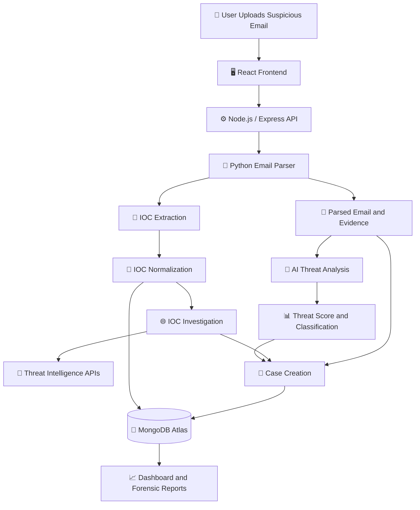
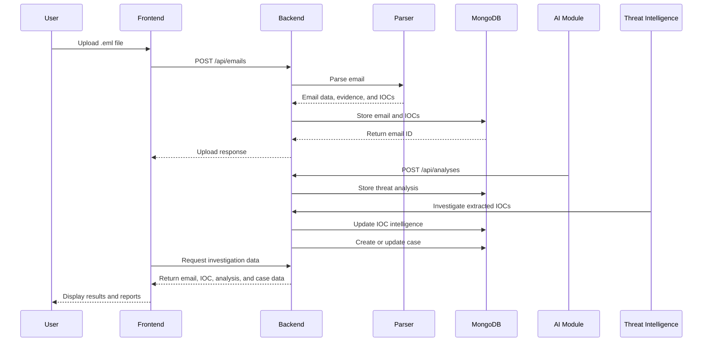
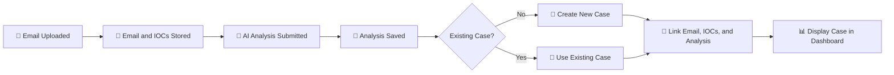

<div align="center">

# 🛡️ Trace-X

### AI-Powered Email Threat Detection, Geolocation & Forensic Intelligence Platform

<p align="center">
  <b>Detect. Investigate. Correlate. Respond.</b>
</p>

</div>

---

Link-https://blank-vite-react-app--lakshitashree16.replit.app

## 📌 Overview

**Trace-X** is an AI-powered email threat detection and forensic intelligence platform designed to identify, analyze, and investigate suspicious emails.

It combines email parsing, IOC extraction, threat intelligence, geolocation, AI-based threat classification, and case management into one centralized platform.

Trace-X helps cybersecurity teams detect phishing, spoofing, Business Email Compromise (BEC), malicious links, and malware-related emails while improving investigation and incident response.

---

## 🚨 Problem Statement

Email-based cyberattacks are becoming increasingly sophisticated. Attackers use:

* 🎭 Sender impersonation and spoofing
* 🔗 Malicious URLs and redirects
* 🦠 Malware-related attachments
* 🏢 Business Email Compromise
* 🌐 Suspicious domains and IP addresses
* 💸 Social engineering and financial fraud

Traditional investigation methods often require analysts to manually inspect headers, extract IOCs, search multiple intelligence sources, and prepare reports.

This process can be slow, fragmented, and difficult to scale.

---

## 💡 Our Solution

Trace-X provides an end-to-end workflow for email threat investigation:

1. 📤 Upload a suspicious `.eml` file.
2. 🔍 Parse the email and extract forensic evidence.
3. 🧩 Extract and normalize Indicators of Compromise.
4. 🌐 Investigate domains, URLs, IPs, and other IOCs.
5. 🤖 Generate AI-based threat classification and risk scores.
6. 📊 Display evidence, findings, and recommendations.
7. 📁 Automatically create and manage investigation cases.
8. 🔗 Connect related emails, IOCs, and threat entities.

---

## ✨ Key Features

| Feature                        | Description                                                                      |
| ------------------------------ | -------------------------------------------------------------------------------- |
| 📧 **Email Forensics**         | Extracts email metadata, body content, headers, and available evidence.          |
| 🧩 **IOC Extraction**          | Identifies IP addresses, domains, URLs, email addresses, and file hashes.        |
| 🛡️ **Threat Detection**       | Supports phishing, spoofing, BEC, malicious links, and malware-related analysis. |
| 🌍 **Geolocation**             | Provides location-related intelligence for relevant IP addresses and domains.    |
| 🤖 **AI Threat Analysis**      | Generates classification, confidence, risk level, threat score, and findings.    |
| 🔗 **Threat Correlation**      | Connects related emails, IOCs, and possible attack campaigns.                    |
| 📁 **Case Management**         | Creates and manages investigation cases with linked evidence.                    |
| 📝 **Forensic Reports**        | Produces structured summaries, findings, and recommended actions.                |
| 📊 **Investigation Dashboard** | Displays threat information, cases, evidence, and IOC relationships.             |

---

## 🏗️ System Architecture



---

## 🔄 Email Investigation Workflow



---

## 📁 Automatic Case Creation

A case is created when threat analysis is submitted for an email.



> **Note:** Uploading an email alone does not create a case. Case creation occurs after `POST /api/analyses` is called.

---

## 🧰 Technology Stack

| Layer                  | Technologies                         |
| ---------------------- | ------------------------------------ |
| 🎨 Frontend            | React.js, Vite                       |
| ⚙️ Backend             | Node.js, Express.js                  |
| 🗄️ Database           | MongoDB Atlas, Mongoose              |
| 🐍 Email Parsing       | Python                               |
| 🤖 AI Analysis         | AI/ML-based threat analysis pipeline |
| 🌐 Threat Intelligence | External intelligence APIs           |
| 🚀 Deployment          | Replit, Render, Vercel               |
| 🧪 Testing             | Postman                              |
| 🔧 Version Control     | Git, GitHub                          |

---

## 🔌 Backend API

### Base URL

```text
https://trace-x-io6z.onrender.com
```

### Health Check

```http
GET /api/health
```

### Email Endpoints

```http
POST /api/emails
GET /api/emails/:id
GET /api/emails/:id/evidence
```

### Analysis Endpoints

```http
POST /api/analyses
GET /api/analyses/:emailId
```

### IOC Endpoints

```http
GET /api/iocs
GET /api/iocs?emailId=<EMAIL_ID>
GET /api/iocs?caseId=<CASE_ID>
```

### Case Endpoints

```http
POST /api/cases
GET /api/cases
GET /api/cases/:id
PATCH /api/cases/:id
```

### Dashboard Endpoint

```http
GET /api/dashboard-stats
```

---

## 🌐 Live Website

Visit the deployed Trace-X platform:

<p align="center">
  <a href="https://blank-vite-react-app--lakshitashree16.replit.app">
    
  </a>
</p>

🔗 **Website:**
https://blank-vite-react-app--lakshitashree16.replit.app

🔗 **Backend API:**
https://trace-x-io6z.onrender.com

---

## 📂 Project Structure

```text
email-threat-platform/
│
├── src/
│   ├── app.js
│   ├── server.js
│   │
│   ├── config/
│   │   └── database.js
│   │
│   ├── controllers/
│   │   ├── emailController.js
│   │   ├── iocController.js
│   │   ├── analysisController.js
│   │   └── caseController.js
│   │
│   ├── models/
│   │   ├── Email.js
│   │   ├── IOC.js
│   │   ├── IOCRelationship.js
│   │   ├── ThreatAnalysis.js
│   │   └── Case.js
│   │
│   ├── routes/
│   │   ├── emailRoutes.js
│   │   ├── iocRoutes.js
│   │   ├── analysisRoutes.js
│   │   └── caseRoutes.js
│   │
│   ├── middleware/
│   │   └── upload.js
│   │
│   └── services/
│       └── parserService.js
│
├── parser.py
├── package.json
├── package-lock.json
├── requirements.txt
├── .env
└── README.md
```

---

## ⚙️ Installation and Setup

### Prerequisites

* Node.js
* npm
* Python 3
* MongoDB Atlas account
* Git

### Clone the Repository

```bash
git clone <repository-url>
cd email-threat-platform
```

### Install Dependencies

```bash
npm install
```

```bash
pip install -r requirements.txt
```

### Configure Environment Variables

Create a `.env` file:

```env
PORT=5000
MONGODB_URI=your_mongodb_connection_string
PYTHON_PATH=python3
VT_API_KEY=your_virustotal_api_key
ABUSEIPDB_API_KEY=your_abuseipdb_api_key
```

### Start the Backend

```bash
npm start
```

For development:

```bash
npm run dev
```

The backend will be available at:

```text
http://localhost:5000
```

---

## 🔐 Security Notes

* Never commit `.env` files to GitHub.
* Do not expose MongoDB connection strings.
* Keep external API keys on the backend.
* Validate uploaded files and file sizes.
* Sanitize email content before displaying it.
* Use HTTPS for production deployments.
* Add authentication and authorization before public production use.

---

## 👥 Team Responsibilities

| Member | Responsibility                                                              |
| ------ | --------------------------------------------------------------------------- |
| **M1** | Cybersecurity rules, email forensics, and threat interpretation             |
| **M2** | Backend APIs, MongoDB schemas, indexes, IOC storage, and data relationships |
| **M3** | `.eml` parsing and IOC extraction                                           |
| **M4** | IOC investigation, geolocation, and threat relationships                    |
| **M5** | AI-based threat classification, scoring, summaries, and recommendations     |
| **M6** | React frontend, dashboard, cases, and visualizations                        |

---

## 📈 Impact

* **Early Threat Identification:** Detects suspicious emails before they cause serious damage.
* **Faster Incident Response:** Helps security teams investigate and respond more quickly.
* **Reduced Financial and Operational Losses:** Helps prevent fraud, data theft, and business disruption.
* **Stronger Digital Forensics:** Supports evidence preservation, threat tracing, and structured investigation.

---

## 🎯 Benefits

* **Safer Digital Ecosystem:** Promotes safer email communication.
* **Economic Resilience:** Helps reduce financial losses and investigation costs.
* **Forensic Intelligence:** Connects evidence, IOCs, and threat data.
* **Operational Efficiency:** Simplifies analysis, reporting, and case management.

---

## 🔮 Future Scope

* 📩 Real-time email monitoring.
* 🏢 Integration with enterprise mail servers.
* 🕸️ Advanced graph-based threat visualization.
* 🧠 Improved AI models for phishing and BEC detection.
* ⚡ Automated incident response.
* 🔗 SIEM and SOC platform integration.
* 👤 Role-based access control.
* 📊 Campaign-level threat detection.
* 🧾 Audit logs and investigation history.

---


This project was developed as part of the **Smart India Hackathon** project work.


<div align="center">

### 🛡️ Trace-X

**Turning suspicious emails into actionable forensic intelligence.**

</div>
